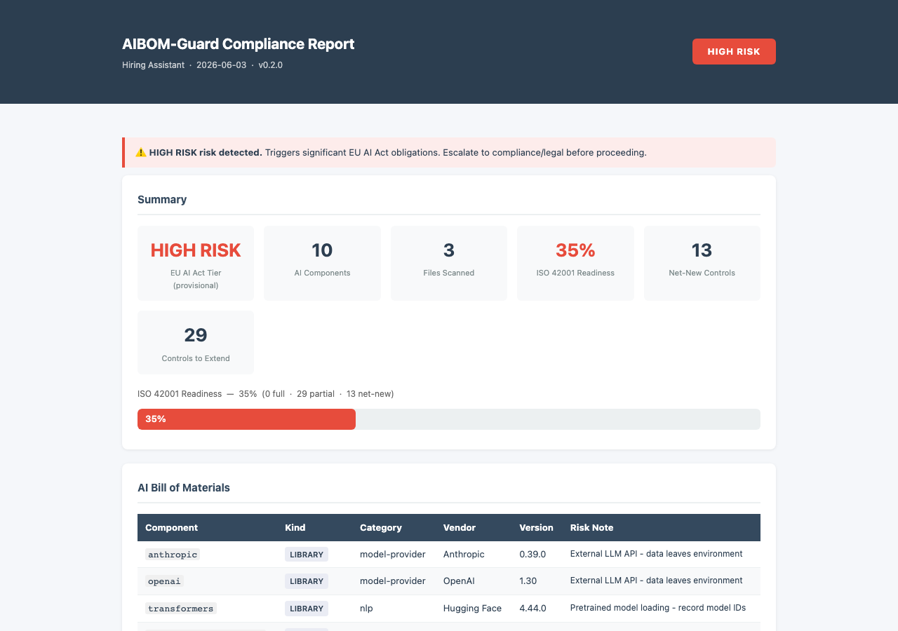

# AIBOM-Guard

**Scan any codebase. Know your EU AI Act risk tier in seconds.**

AIBOM-Guard is an offline CLI tool that generates a CycloneDX AI Bill of Materials, classifies EU AI Act risk (prohibited / high / limited / minimal), maps ISO 27001 → ISO 42001 gaps, and drafts Annex IV technical documentation — from a single command.

> **Triage aid, not legal advice.** Always confirm HIGH/PROHIBITED results with qualified compliance or legal counsel before acting.

---

## Dashboard



*The `--html` flag generates a self-contained dashboard. Open directly from disk — no server required.*

---

## What it does

| Capability | Output |
|---|---|
| **AI component scanner** | 220+ Python libs, 34 JS libs, 21 model file types |
| **CycloneDX 1.6 AI-BOM** | `aibom.cdx.json` — machine-readable, schema-validated |
| **SPDX 3.0 AI Profile** | `aibom.spdx.json` — alternate BOM format |
| **EU AI Act classifier** | 21 categories across prohibited / high / limited tiers |
| **ISO 27001 → 42001 gap** | 42 controls, net-new vs extend, readiness % |
| **NIST AI RMF 1.0** | GOVERN / MAP / MEASURE / MANAGE subcategories |
| **Annex IV docgen** | `annex_iv.md` — technical documentation draft |
| **HTML dashboard** | `compliance_report.html` — self-contained, shareable |

---

## Get started in 30 seconds

```bash
pip install aibom-guard
aibom-guard all ./my-ai-project --name "My App" --use-case "describe what it does" --html -o reports/
```

→ [Full quickstart guide](quickstart.md)

---

## Standards

- [EU AI Act](https://eur-lex.europa.eu/legal-content/EN/TXT/?uri=CELEX:32024R1689) (Regulation EU 2024/1689)
- [CycloneDX 1.6](https://cyclonedx.org/specification/overview/) + [SPDX 3.0 AI Profile](https://spdx.github.io/spdx-spec/v3.0/)
- [ISO/IEC 42001:2023](https://www.iso.org/standard/81230.html)
- [NIST AI RMF 1.0](https://airc.nist.gov/RMF_Overview)
